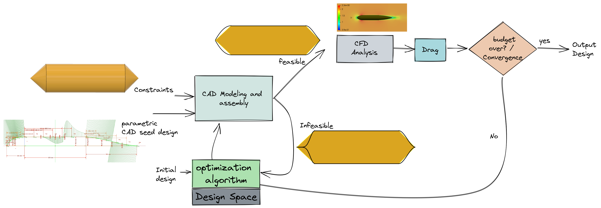
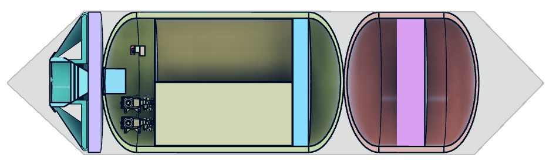
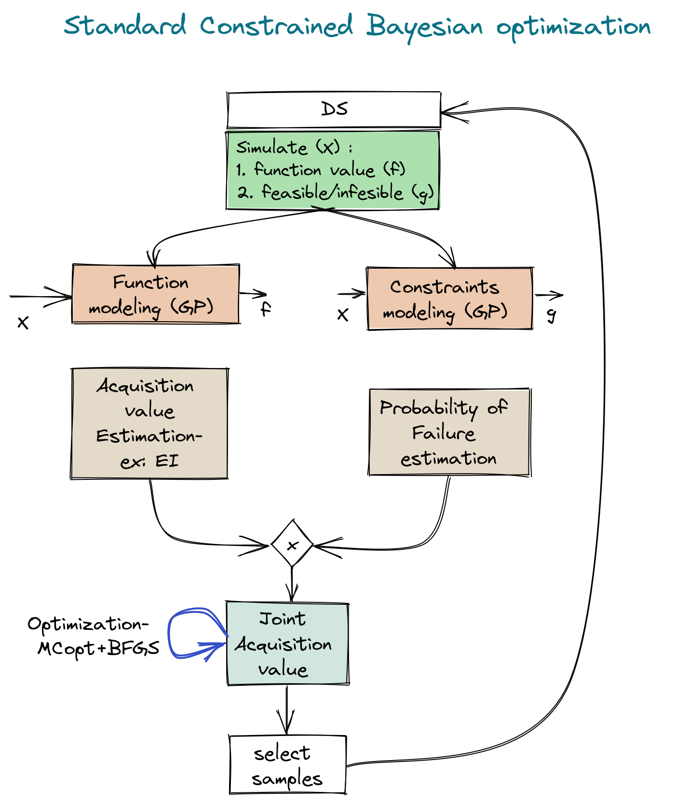
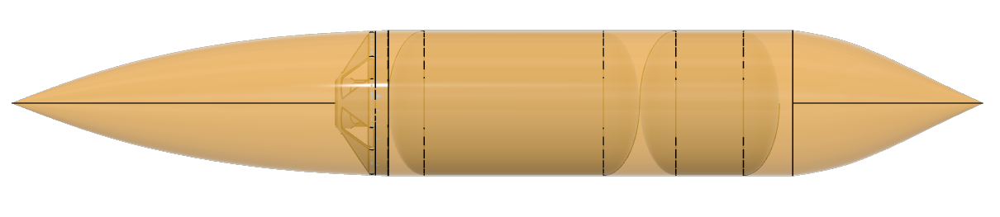

# Contrained Bayesian optimization for Underwater vehicle hull design

In this work, the research motivation is to integrate and deploy the AI based constraint Bayesian optimization to the computationally complex and hard design problem that involves complex engineering domains like CAD and CFD in loop. The constrained is generated by packing the components in the UUV. To, this end we used the following pipeline: 

# Constraint: 

## Constained BO:

### Optimization process: 

### Results:

